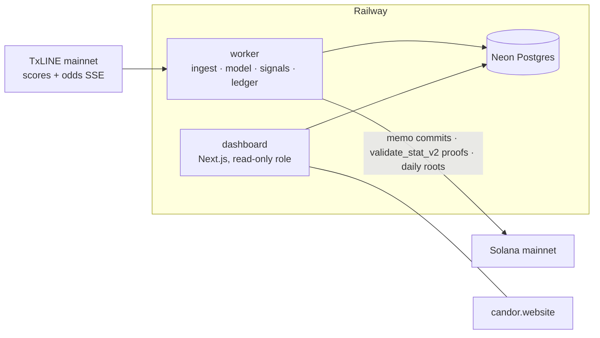

<p align="center">
  
</p>

<h1 align="center">CANDOR</h1>

<p align="center"><b>The trading agent that cannot lie about its record.</b></p>

<p align="center">
  <a href="https://candor.website">candor.website</a> ·
  <a href="https://candor.website/api/record">public record export</a> ·
  <a href="https://candor.website/verify">how to verify me</a>
</p>

---

Candor is an autonomous sports trading agent built for the TxODDS World Cup Hackathon
(Trading Tools and Agents track). It ingests TxLINE's live odds and scores firehoses,
prices every quoted line with its own model, takes paper positions on a frozen strategy,
and, this is the point, produces a track record that is **impossible to fake**:

- Every position is hashed and **committed to Solana mainnet before its outcome exists**.
- Every settled position is **proven on-chain** against the Merkle roots TxODDS anchors,
  via the oracle program's `validate_stat_v2`. Wins and losses are proven identically.
- Every number on the public dashboard carries a verify link or is recomputable from the
  machine-readable record export. You do not have to trust the website, the repo, or us.

Every tipster, signal seller, and trading bot self-reports its results. Screenshots of
winners, deleted losers, backdated picks: fake track records are the defining fraud of the
industry, and until match truth lived on a chain there was no neutral way to prevent it.
TxLINE anchors match truth on Solana. Candor is the first trader built so that its honesty
is a protocol rather than a promise.

**No real money is involved anywhere.** The bankroll is 1,000.00 paper units by design and
by rule. Solana mainnet is the trust layer only; the agent never custodies funds and the
TxL token is used for data access, never traded.

> **Documentation:** the full five-chapter set lives in [`docs/`](docs/README.md) —
> [trust layer](docs/trust-layer.md) · [how it trades](docs/how-candor-trades.md) ·
> [parameter tuning](docs/params-tuning.md) · [TxLINE integration](docs/txline-integration.md) ·
> [architecture](docs/architecture.md)

## Contents

- [Documentation](docs/README.md)
- [The honesty protocol](#the-honesty-protocol)
- [Verify the record yourself](#verify-the-record-yourself)
- [The strategy inside](#the-strategy-inside)
- [Architecture](#architecture)
- [Determinism and the verification bar](#determinism-and-the-verification-bar)
- [Exactly how TxLINE is used](#exactly-how-txline-is-used)
- [Empirical findings the build surfaced](#empirical-findings-the-build-surfaced)
- [Running it yourself](#running-it-yourself)
- [Repository layout](#repository-layout)
- [What Candor never does](#what-candor-never-does)

## The honesty protocol

Full specification with the exact byte formats, threat model, and live artifacts:
[`docs/trust-layer.md`](docs/trust-layer.md). The construction is not specific to this
agent (we call it the Candor protocol; any signal vendor or fund could run the same
cycle). The short version: four mechanisms, all live on mainnet from the agent's own
wallet
([`DKdqzAhvYMB3TZFZSM7M6JA3nQqmsjk5W9Smo6vq7xrE`](https://solscan.io/account/DKdqzAhvYMB3TZFZSM7M6JA3nQqmsjk5W9Smo6vq7xrE)).

### 1. Commit at decision time

The moment a position opens, the worker canonicalizes the complete decision into a JSON
payload (schema `candor.position.v1`: fixture, market key, scope, side, family, price
taken, model and market probabilities, stake, bankroll before, entry score, decision
timestamp, and the strategy hash), hashes it with sha256, and broadcasts a memo
transaction:

```
candor|v1|commit|<payload sha256>|params:<strategy hash, 16 chars>|prev:<previous commit signature | genesis>
```

The chain timestamp proves the position existed before the outcome. The `prev` field
chains every commit to the one before it, so the record is append-only: deleting a losing
position leaves a hole any verifier can see. Commits are strictly serialized so the chain
stays linear, retried on failure, and marked `failed` visibly if mainnet cannot be reached
(source: [`src/chain/commit.ts`](src/chain/commit.ts)).

A real example, from the live record: position #4 (Under 1.5 first-half goals, Argentina v
Switzerland, World Cup quarterfinal) was committed at 01:01:38 UTC, one minute after
kickoff, hours before the outcome existed:
[`43P8YQpf…`](https://solscan.io/tx/43P8YQpfANktVPWrkFYfHAYCTSwX62jw1twjis4sB9aLPoM5fATYGKRSDGckV6LiX7zRMM62BHxgXFGmJctN4QJD).

### 2. Prove at settlement

TxODDS anchors per-match statistics on Solana as Merkle roots. When a match finalises,
Candor grades its positions from the certified period bands, then compiles **each
position's exact win condition** into a `validate_stat_v2` call on the oracle program
([`9ExbZjAapQww…`](https://solscan.io/account/9ExbZjAapQww1vfcisDmrngPinHTEfpjYRWMunJgcKaA))
and broadcasts it. The proof does not say "the score was 2 to 1"; it says **this
position's claim evaluated true (or false) against the root TxODDS committed**:

| Market | Compiled predicate |
|---|---|
| Home win (1X2) | `goals1 − goals2 > 0` (binary subtract) |
| Draw | `goals1 − goals2 == 0` |
| Over 2.5 goals | `goals1 + goals2 > 2` (binary add, push handled separately) |
| First-half markets | same predicates on the `+1000` period band keys |
| Full-match after extra time | component proof: four `equalTo` legs pinning the H1 and H2 bands |

Before broadcasting, the worker simulates the proof and requires the simulated verdict to
match its own settlement; a mismatch blocks the broadcast and flags the position
(source: [`src/chain/proof.ts`](src/chain/proof.ts)). Every settled position ends in
exactly one of three states, shown publicly: `proven`, `proof_unavailable` (with the
reason), or `void`. There is no fourth state.

Real examples: position #3's win proven at
[`BA7FsisU…`](https://solscan.io/tx/BA7FsisUkUDV3bRnRvVGXRcNAxUNGAYdBzRLWd3tuAL6jZNpGbq3jjR6nq2LLbtb866vG14chvDWxjNqFkPekx3),
position #4's at
[`21tPRJdm…`](https://solscan.io/tx/21tPRJdmUFfkYZhKRASW5LuQPWDos2LveKpDPaHxuu5giF7eaj6wjqm7637WoGi8wWm4GDpRPX7feuEVfRH8w3uS)
(that one self-healed through the proof retry sweep after the anchoring lag, with no human
involved). During validation we also proved a deliberately false claim is rejected
on-chain; both directions are exercised before anything is trusted.

### 3. Freeze the strategy, publicly

Every commit carries the hash of the complete strategy parameter set. The parameters were
tuned on recorded matches, frozen before deployment, and the freeze itself was committed
to mainnet as a ceremony transaction:
[`3xmdHkBG…`](https://solscan.io/tx/3xmdHkBGzghmi11ffuLSZfvgrdm7WezSZvA21qtub9nim9HN63vXDFixHALZyk1yfFqguYBpykM7V2XW3mniZfmB),
binding hash `e8d0d4b6f761e75ceecdb8d7f0ea321d27f188d39db2ba3763f65c776d4842d8`. If a
threshold ever moved mid-run, the hashes in the chain would show the seam. The parameter
derivation, including its dead ends, is documented in
[`docs/params-tuning.md`](docs/params-tuning.md).

### 4. Seal the reasoning trail

Every decision the agent takes, including passes, is logged with its inputs and reasoning.
Once per UTC day the worker builds a Merkle tree over the day's full signal log and
commits the root to mainnet (`candor|v1|decisions|<date>|root:…|n:…|prev:…`), so even the
narrative around the record is provably unedited after the fact
(source: [`src/chain/decisions-root.ts`](src/chain/decisions-root.ts)).

## Verify the record yourself

You need nothing from us but a Solana RPC. The complete procedure lives at
[candor.website/verify](https://candor.website/verify); the short version:

1. **Fetch the record**: [`GET /api/record`](https://candor.website/api/record) returns
   every position with its canonical payload, hashes, signatures, settlement evidence, and
   the full signal log.
2. **Recompute a hash** and compare it to `payload_hash`:

   ```bash
   node -e "const c=require('crypto');fetch('https://candor.website/api/record').then(r=>r.json()).then(r=>{const p=r.positions[0];console.log(c.createHash('sha256').update(p.payload_canonical).digest('hex')===p.payload_hash?'hash matches':'MISMATCH')})"
   ```

3. **Read the commit transaction** (`commit_sig`) on any explorer: the memo carries that
   hash, the frozen params hash, and the previous signature, at a block time before the
   match ended.
4. **Read the proof transaction** (`proof_sig`): a `validate_stat_v2` call against TxODDS's
   root returning the position's certified verdict.

Or press **Verify** on any position at [candor.website/positions](https://candor.website/positions):
your own browser recomputes the hash with WebCrypto and reads the commit transaction from
a public RPC. This site is deliberately not in the trust path.

## The strategy inside

The accountability protocol is the invention; the trader inside it is still built fully,
because an honest record of a toy would prove nothing. The complete orientation document
is [`docs/how-candor-trades.md`](docs/how-candor-trades.md); the one-paragraph version:

Candor does not predict matches from history or news. It reads the entire quoted board
(1X2, over/under, Asian handicap; full match and first half) from TxLINE's StablePrice
consensus, and every five seconds fits a Poisson model of the **remaining** goals implied
by the live totals lines, splitting it between the teams against the quoted 1X2. That
model then prices every line on the board. When one line's demargined probability
disagrees with the model by more than that market bucket's **measured noise floor**
(thresholds derived on recordings and frozen: 2.5 points base, 6.0 for Asian handicap,
documented in the tuning paper trail), and survives freshness, liveness, phase, and
honest-fill gates, it becomes an entry candidate. A second family watches for sharp
movement (per-line z-score jumps) and arms the divergence scan on lines re-quoted after
the jump. Stakes are quarter-Kelly, capped at 2% of bankroll, with per-match and
concurrency exposure limits. Measurement is deliberately the professional kind: fixed
horizon closing line value (an in-play line's last quote restates the outcome, so a
10-minute horizon isolates whether the market moved toward the position while it still
traded), Brier calibration against the consensus on the same positions, drawdown, and
exposure statistics. All of it is displayed, including when it is unflattering; negative
CLV on winning positions is reported in the same register as the wins.

## Architecture

Two small services and a database, deliberately boring. The full chapter, including the
bootstrap order, every runtime loop, warmup, the data model, and the failure-mode table:
[`docs/architecture.md`](docs/architecture.md).



| Piece | What it does | Where |
|---|---|---|
| Worker | One long-running Node process: fixture discovery, serialized scores fold, batched odds book, 5-second evaluation cadence, paper ledger, commit chain, settlement, proofs, retry sweeps, daily decisions roots, health endpoint. Restart-safe: warms up from the database and snapshots. | [`src/worker/`](src/worker/) |
| Dashboard | Public, read-only. Connects through a `SELECT`-only Postgres role (`candor_reader`), so the public surface cannot write the record even if compromised. | [`dashboard/`](dashboard/) |
| Database | Nine tables: fixtures, match_state, odds_latest, odds_history, signals, positions, settlements, proofs, agent_state. | [`src/db/schema.sql`](src/db/schema.sql) |
| Chain | SPL Memo for commits and roots; TxODDS `txoracle` for proofs; ~5,000 to 8,000 lamports per transaction from the agent's own wallet. | [`src/chain/`](src/chain/) |

Operational rules the deployment enforces: exactly **one writer** (the Railway worker;
local workers are killed at cutover and stay dead), params frozen (a mid-run bugfix may
change code, which is visible as an epoch in the commit stream, but never parameters), and
the dashboard redeployable all day without touching the trader.

## Determinism and the verification bar

The judging rubric asks for deterministic, defensible logic. Candor makes that checkable
rather than asserted:

- **Byte-identical replays**: [`tests/determinism.ts`](tests/determinism.ts) runs full
  recorded matches through the exact production stack, twice in-process and once in a
  fresh process, and requires byte-identical digests of every decision **and** every
  accountability artifact: canonical payloads, payload hashes, commit memo bodies, and the
  bankroll trajectory. Same recording in, same on-chain bytes out.
- **Grader parity**: the production settlement grader and the replay harness grader are
  asserted to agree on every entry, so tuning evidence and live settlement can never
  silently diverge.
- **Frozen-replay pins**: the frozen parameters must keep reproducing the documented
  tuning-sweep results on the recordings (3 entries, 2 won 1 lost, +9.2 units), including
  reproducing the two entries the live agent actually took, at the same lines and prices.
- **True and false cases on-chain**: every proof mechanism was validated in both
  directions on mainnet before being trusted (a true claim about a real final returned
  true, a false claim returned false), including the extra-time component-proof path.
- **In-browser verifier**: the dashboard's verify button re-derives the record in the
  visitor's own browser, keeping this site out of its own trust path.

Match recordings are captured from the live streams by
[`scripts`](docs/how-candor-trades.md) tooling and are not part of the repository; the
determinism suite runs over whichever recordings exist locally.

## Exactly how TxLINE is used

Candor consumes the TxLINE mainnet real-time subscription (World Cup and International
Friendlies service level), plus the Solana programs it anchors to. The full chapter,
including stream operational behavior, payload anatomy, and the corrected period-band
table: [`docs/txline-integration.md`](docs/txline-integration.md). Every surface, from
[`src/txline/client.ts`](src/txline/client.ts):

| Surface | Use |
|---|---|
| `POST /auth/guest/start` | JWT issue and re-issue when the session token goes stale |
| `GET /api/fixtures/snapshot` | fixture discovery every 10 minutes; new fixtures (semifinals, final) appear automatically |
| `GET /api/scores/stream` (SSE) | the scores firehose: phases, clock, per-period stat bands, `game_finalised` |
| `GET /api/odds/stream` (SSE) | the StablePrice odds firehose: demargined consensus per line, pre-match and in-play |
| `GET /api/scores/snapshot/{id}` + `GET /api/odds/snapshot/{id}` | restart-safe warmup re-seeds live state; the scores snapshot also seeds the match recorder |
| `GET /api/scores/stat-validation` | settlement-grade Merkle proof payloads for `validate_stat_v2` |
| `validate_stat_v2` (on-chain) | one call certifies a position's entire win condition against TxODDS's root (1.4M CU) |
| SPL Memo (on-chain) | position commits and daily decisions roots |

Stream handling detail that mattered in production: both firehoses are deflate-encoded
with ~20 second heartbeats; the worker runs a 90-second liveness watchdog, reconnects with
backoff, dedupes scores by `(FixtureId, Id, Seq)` and odds by `MessageId`, and folds stats
as latest-value because VAR retractions genuinely roll bands back mid-match.

The V3 validation path (`stat-validation-v3` + `validate_stat_v3` multiproofs) was
rehearsed end to end on devnet with this same wallet, true and false cases and a real
broadcast, so if TxODDS promotes it to mainnet the proof layer lifts over in a small,
already-tested change.

## Empirical findings the build surfaced

Things the docs did not say, established from recordings and live matches, and fed back to
TxODDS as a 14-item evidence-backed feedback report (curated separately in the
submission):

1. **The soccer period-band table is wrong in the docs.** Observed on `game_finalised`
   records: `+1000` = first half, `+2000` = halftime cumulative, `+3000` = second half,
   `+4000` = first extra-time period, `+7000` = extra-time cumulative. Settling from the
   documented table silently corrupts second-half and full-match outcomes.
2. **In-running Asian handicap lines are remaining-goals handicaps**, never full-match
   margins. The two readings coincide at level scores, which is exactly why it is easy to
   ship wrong.
3. **Quarter lines never carry demargined probabilities** (`Pct: ["NA","NA"]`), so they
   cannot be signal targets.
4. **Validation payloads lag finalisation** (Merkle batch anchoring) and the lag presents
   as a bare 404; `game_finalised` itself follows the final whistle by several minutes.
   The worker's proof retry sweep exists for precisely this window.
5. **VAR rollbacks are real**: a disallowed goal rolled the stat bands back three minutes
   later. Stats must be folded latest-value, never monotonically.
6. **`.view()` simulations need a funded fee payer**, signed memos cost ~140k CU, and
   multi-leg validations need the full 1.4M CU limit.

## Running it yourself

Prerequisites: Node 20+, a Postgres database, a funded Solana wallet (mainnet lamports for
commits and proofs), and TxLINE API access (the World Cup tiers are free during the
event; see TxODDS's documentation).

```bash
git clone https://github.com/AngryPacifist/Candor
cd Candor && npm install
cp .env.example .env        # fill in the values below
npm run migrate             # applies src/db/schema.sql (idempotent)
npm run worker              # the whole agent: ingest, trade, commit, settle, prove
cd dashboard && npm install && npm run dev   # public dashboard on :3100
```

| Variable | Meaning |
|---|---|
| `TXLINE_API_ORIGIN` | `https://txline.txodds.com` |
| `TXLINE_API_TOKEN` | long-lived TxLINE API token (from the subscribe + activate flow) |
| `TXLINE_JWT` | bootstrap session JWT; the client re-issues automatically |
| `SOLANA_RPC_URL` | mainnet RPC (commits, proofs, balance guard) |
| `SOLANA_DEVNET_RPC_URL` | optional; V3 rehearsal tooling |
| `AGENT_KEYPAIR_PATH` / `AGENT_KEYPAIR_JSON` | the agent wallet (file path locally; raw JSON array on hosted platforms) |
| `DATABASE_URL` | Postgres owner string for the worker; give the dashboard a read-only role instead |
| `PUBLIC_URL` | the dashboard's public origin |

Tests: `npm run typecheck` in both packages, and `npx tsx tests/determinism.ts` (needs
local recordings). The worker exposes `GET /health` for platform checks and refuses to
start with named errors if the environment is incomplete.

## Repository layout

```
src/
  txline/     REST + SSE client (reconnect, watchdog, JWT re-issue), record types
  ingest/     fixture discovery, serialized scores fold, batched odds book
  model/      market parsing, the remaining-goals Poisson fair-price engine
  strategy/   frozen params (hashed), divergence + movement signals, Kelly sizing
  ledger/     paper ledger, exposure gates, settlement from certified period bands
  chain/      memo commit chain, validate_stat_v2 proofs, daily decisions roots
  replay/     deterministic replay of full recordings through the production stack
  worker/     bootstrap (health-first, named env validation) + the autonomy loop
  db/         schema (nine tables) + migration
dashboard/    public read-only Next.js app: record, receipts, charts, verifier
docs/         trust-layer.md · txline-integration.md · architecture.md ·
              how-candor-trades.md (the strategy) · params-tuning.md (the derivation)
tests/        determinism suite (decisions + on-chain artifacts + grader parity)
```

## What Candor never does

- Never touches real money: no custody, no wagers, no payouts; paper units only.
- Never trades the TxL token: it is data access, nothing else.
- Never edits the past: commits are hash-chained, the strategy hash is frozen and
  ceremony-anchored, settlements carry evidence, and degraded states are shown as
  degraded rather than hidden.
- Never asks to be believed. That is the whole point.

---

<p align="center">
  Built solo for the TxODDS World Cup Hackathon, Trading Tools and Agents track ·
  data by <a href="https://txline.txodds.com">TxLINE</a>, anchored on Solana ·
  live at <a href="https://candor.website">candor.website</a>
</p>
